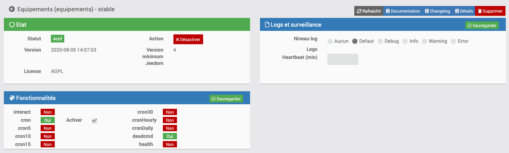

# Plugin Equipements

Le plugin Equipements permet la création de périphériques virtuels avec des templates préconfigurer pour chaque domaine. Chaque template intègre également un widget adapté pour le dashboard et les designs. 

Ce plugin reprend les caractéristiques du plugin virtuel en ajoutant un affichage et les commandes adapté au domaine d'utilisation.

# Configuration

Le plugin ne nécessite aucune configuration, il faut juste l’activer :

# Configuration des équipements

La configuration des équipements est accessible à partir du menu plugin :

Voilà à quoi ressemble la page du plugin equipements (ici avec différents équipements ajouté) :

Voilà à quoi ressemble la page de configuration d’un équipement :

Vous retrouvez ici toute la configuration de votre équipement :

-   **Nom de l'équipement** : nom de votre équipement,
-   **Objet parent** : indique l’objet parent auquel appartient l'équipement,
-   **Catégorie** : les catégories de l'équipement (il peut appartenir à plusieurs catégories, ce paramètre est ajouté automatiquement avec le template),
-   **Activer** : permet de rendre votre équipement actif,
-   **Visible** : le rend visible sur le dashboard,
-   **Sélectionner le type d'équipement** : Choisir le template aproprié.

En haut à droite vous avez accès à 4 boutons :

-   **Dupliquer** : permet de dupliquer l'équipement courant,
-   **Configuration avancée (roues crantées)** : permet d’afficher les options avancées de l'équipement (commun à tous les plugins Jeedom).
-   **Sauvegarder** : permet de sauvegarder votre équipement après la sélection du template, ou lors d'une modification.
-   **Supprimer** : permet de supprimer votre équipement.

Dans la section Commandes :

-   le nom des commandes,
-   le type et le sous-type,
-   la valeur : permet de donner la valeur de la commande en fonction d’une autre commande, d’une clef (quand on fait un interrupteur virtuel), d’un calcul, etc.
-   "Valeur de retour d'état" et "Durée avant retour d'état" : permet d’indiquer à Jeedom qu’après un changement sur l’information sa valeur doit revenir à Y, X min après le changement. Exemple : dans le cas d’un détecteur de présence qui n'émet que lors d’une détection de présence, il est utile de mettre par exemple 0 en valeur et 4 en durée, pour que 4 mn après une détection de mouvement (et s’il n’y a en pas eu de nouvelle(s) depuis) Jeedom remette la valeur de l’information à 0 (plus de mouvement détecté),
-   unité : unité de la donnée (peut être vide),
-   historiser : permet d’historiser la donnée,
-   afficher : permet d’afficher la donnée sur le dashboard,
-   min/max : bornes de la donnée (peuvent être vides),
-   configuration avancée (petites roues crantées) : permet d’afficher la configuration avancée de la commande (méthode d’historisation, widget, etc.),
-   "Tester" : permet de tester la commande.

# Tutoriel

## Eclairage

Pour cette exemple, nous allon réaliser un equipement éclairage (ON/OFF) :

Renseignez le nom de votre équipement puis sélectionner le type d'équipement.

> **Tip**
>
> N'oublier pas de sauvegarder après la sélection du template.

Nous voila avec notre équipement éclairage pré configuré.

Il ne nous reste plus qu'à affecter les commandes d'équipements physique au commande correspondante à notre équipement.

> **Tip**
>
> N'oublier pas de sauvegarder après le choix des commandes.

Voila à présent le rendu visuel de votre équipement éclairage.

Le principe reste le même pour n'importe quel template d'équipements.